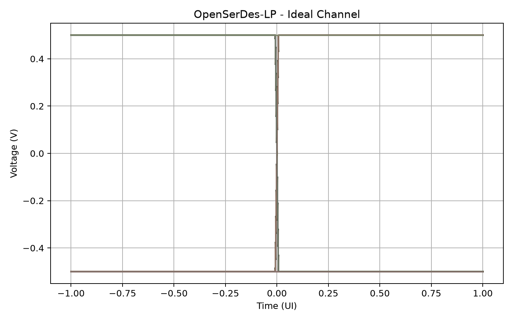
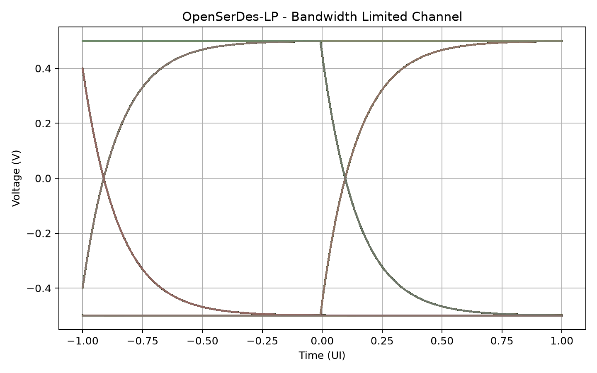
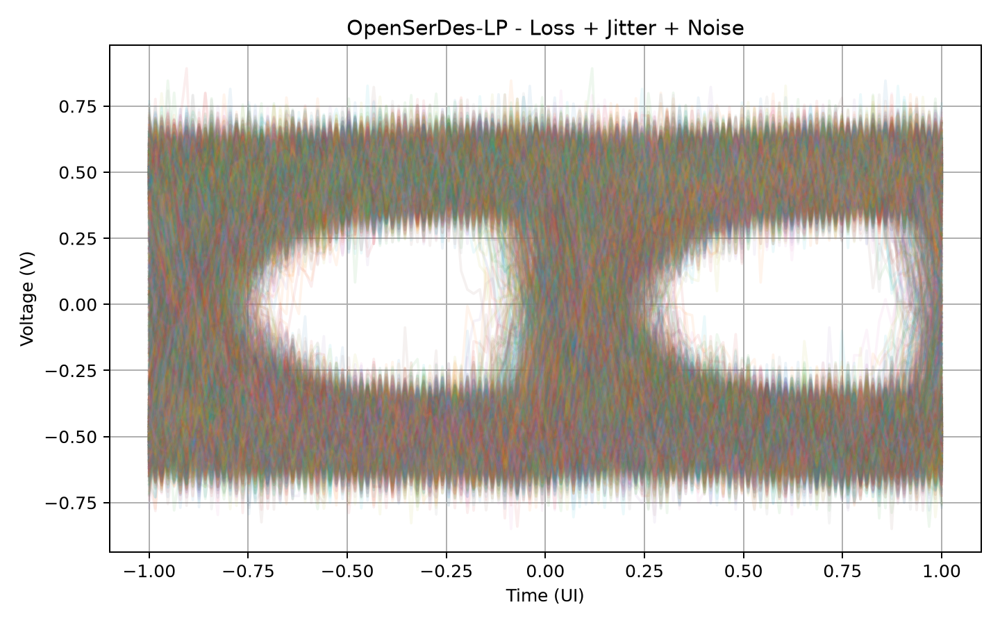
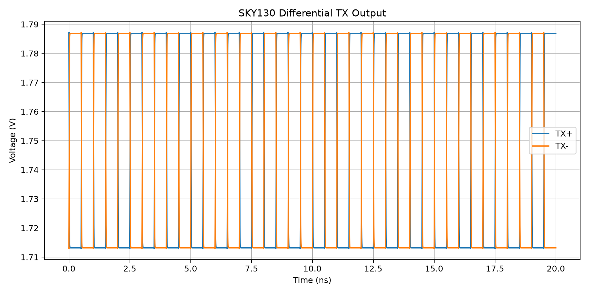
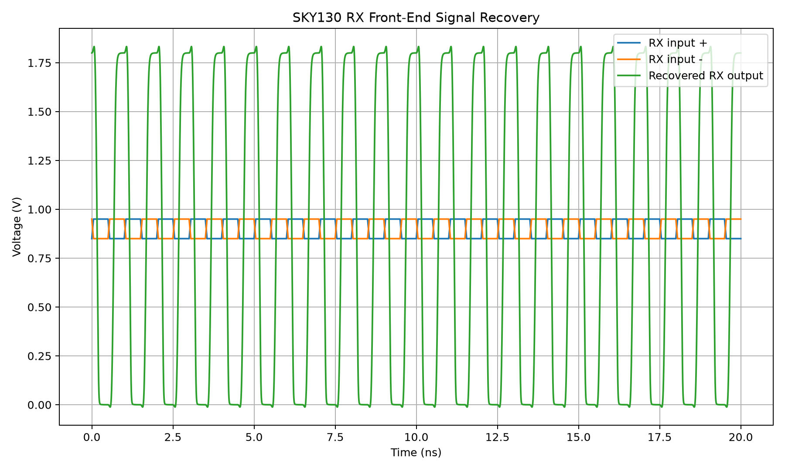

## Current Link Performance

| Metric | Result |
|---|---:|
| Data rate | 1 Gb/s |
| Clean-link BER | 0 / 8000 bits |
| Error-injection BER | 1e-3 |
| TX power | ~1.80 mW |
| RX power | ~0.435 mW |
| TX + RX power | ~2.24 mW |
| Energy efficiency | ~2.24 pJ/bit |

## Verification Status

| Block | Status |
|---|---|
| PRBS7 Generator | PASS |
| 8-bit Serializer | PASS |
| 8-bit Deserializer | PASS |
| PRBS Checker | PASS |
| Digital SerDes Loopback | PASS |
| BER Error Detection | PASS |
| Channel Model | PASS |
| Eye Diagram Analysis | PASS |
| SKY130 TX SPICE Simulation | PASS |
| SKY130 RX SPICE Simulation | PASS |
| TX Xschem Schematic | COMPLETE |
| RX Xschem Schematic | COMPLETE |
| Physical Layout | EXPERIMENTAL / WIP |
| DRC / LVS | FUTURE WORK |

## Simulation Results

### Eye Diagrams

Clean channel:

Lossy channel:

Jitter + noise:

### Analog TX

### Analog RX

## Physical Design

A SKY130 physical-layout prototype was explored using Magic VLSI.

The current layout demonstrates transistor placement and early routing of
the differential pair. Physical verification is not yet DRC/LVS clean and
is intentionally marked as work in progress.

## Future Work

- Complete SKY130 TX/RX physical layout
- Achieve DRC-clean layout
- Perform Netgen LVS verification
- Post-layout parasitic extraction
- Post-layout simulation
- CMOS bias circuit
- Clock recovery
- Equalization