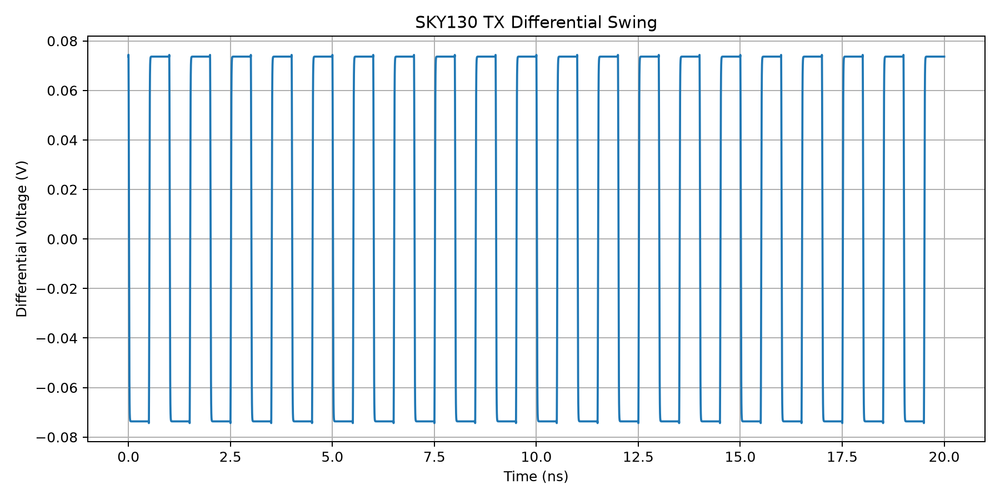

# OpenSerDes-LP

Low-Power Mixed-Signal SerDes Link in SKY130 CMOS

## Overview

OpenSerDes-LP is a project that demonstrates the core building blocks of a low-power mixed-signal SerDes link.

Current v0.1 focuses on:
- PRBS7 data generation
- 8:1 serializer
- 1:8 deserializer
- BER checking
- channel error injection
- eye diagram generation
- loss / jitter / noise visualization

This project is intended as an educational and portfolio project for mixed-signal / high-speed I/O / SerDes learning.

---

## Features

- **PRBS7 Generator**
- **8-bit Serializer**
- **8-bit Deserializer**
- **Digital SerDes Loopback**
- **BER Checker**
- **Channel Error Injection**
- **Eye Diagram Generation**
- **Loss / Noise / Jitter Simulation**

---

## Project Structure

```text
OpenSerDes-LP/
├── rtl/
│   ├── prbs7.sv
│   ├── prbs7_byte_gen.sv
│   ├── serializer8.sv
│   ├── deserializer8.sv
│   ├── prbs_checker.sv
│   └── channel_model.sv
├── tb/
│   ├── tb_prbs7.sv
│   ├── tb_serializer8.sv
│   ├── tb_serdes_link.sv
│   ├── tb_prbs_serdes.sv
│   └── tb_channel_ber.sv
├── scripts/
│   ├── run_all.sh
│   └── eye_diagram.py
├── docs/
│   └── results/
│       ├── eye_clean.png
│       ├── eye_lossy.png
│       └── eye_jitter_noise.png
├── analog/
├── layout/
├── README.md
└── LICENSE


---

## Results

### Digital SerDes Link

Clean-channel verification:

- Total bits: 8000
- Bit errors: 0
- BER: 0

Error-injection verification:

- Total bits: 8000
- Bit errors: 8
- BER: 1e-3

### Eye Diagrams

#### Ideal Channel


#### Bandwidth-Limited Channel


#### Loss + Jitter + Noise


---

## SKY130 Differential TX

- Process: SKY130A
- Supply: 1.8 V
- Data rate: 1 Gb/s
- Differential Vpp: ~148.7 mV
- Average power: ~1.80 mW
- Energy/bit: ~1.80 pJ/bit




---

## SKY130 RX Front-End

- Differential input: ~100 mV
- Output swing: ~0 V to 1.8 V
- Average power: ~0.435 mW
- Energy/bit: ~0.435 pJ/bit


---

## Current Link Performance

| Metric | Result |
|---|---:|
| Data rate | 1 Gb/s |
| Clean-link BER | 0 / 8000 bits |
| Error-injection BER | 1e-3 |
| TX power | ~1.80 mW |
| RX power | ~0.435 mW |
| TX + RX power | ~2.24 mW |
| TX + RX energy | ~2.24 pJ/bit |

> TX and RX analog prototypes currently use ideal tail-current sources. Future revisions will replace them with transistor-level bias circuits.

---

## Future Work

- CMOS bias circuit
- Xschem schematic
- TX/RX integration
- DRC / LVS
- Post-layout simulation
- Clock recovery
- Equalization